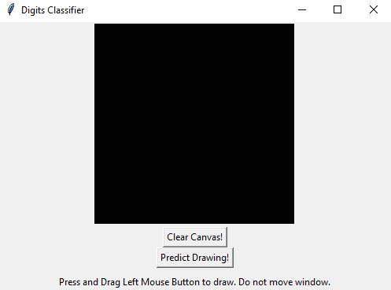
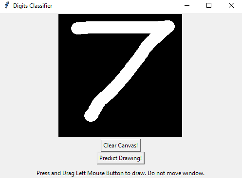
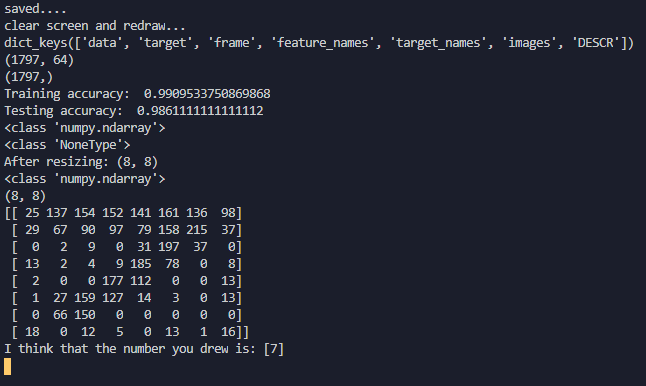

# draw-digit-classifier
You draw a digit in a tkinter interface. Code classifies it. Result is displayed in terminal. That's it. Made from scratch. First independent ML project. 

Here, we run tkinterInterface.py and we are greeted with a rather small interface on the screen.

Next, write any number. Let's do 7!

When we click 'Predict Drawing!,' the black canvas saves itself as an image and MLcode.py runs to classify the number drawn.

